# Garrett Zsh Theme for Prezto

> A prompt with the information you need the moment you need it.

**NEW: It's been a long time coming but I've finally added gifs so you can see
what the fuss is all about!**

I designed my prompt for readability and to present useful information when it
is needed and to hide it otherwise.

The Garrett prompt supports line drawing, git information, ssh status,
directory truncation, vi-editor info, the full range of prompt types (PS1-PS4,
Autocorrection, and a backup SUDO_PS1), notification of background jobs,
non-zero return codes, and job completion, the current shell level and ruby
version, history line number, and the current time.

## Prompt types

### Standard Prompt (PS1)

Many (most?) prompts put the directory information in front of the cursor
entry point. Changing directories changes the location of the cursor on the
screen. This inconsistent location is undesirable. The Garrett prompt cursor is
consistently at the same place on the screen.

By using line drawing and inserting a newline between each command, scrolling
back through your history for the output of a previous command becomes
drastically easier.

Terminal supports line drawing and the prompt will look it's best there.

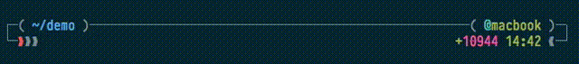

The Garrett prompt does have a fallback if line drawing is unsupported by your
terminal emulator. The following gif was taken in iTerm2, which doesn't seem to
support line drawing. If you know how to get this to work, please open an issue.

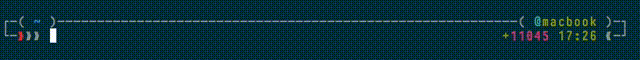

The terminal theme shown here is [Solarized
Dark](http://ethanschoonover.com/solarized) and the font is [Pragmata
Pro](http://on.chauncey.io/1GX4ZGU) (affiliate link).

### Right Prompt (RPROMPT)

The right prompt is contains useful information but will be removed when long
commands are typed.

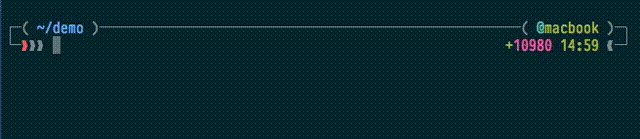

### Continuation prompt (PS2)

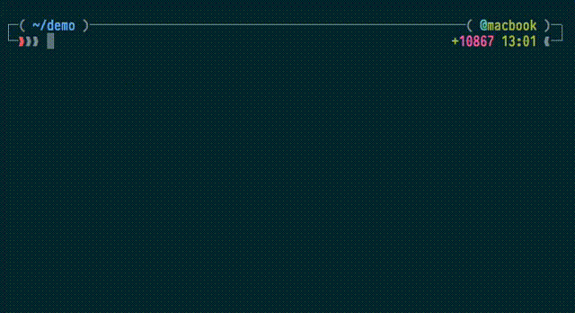

### Selection prompt (PS3)

Note that his view contains both the selection *and* continuation prompts. The
selection prompt is shown when entering 1, 2, or 3.

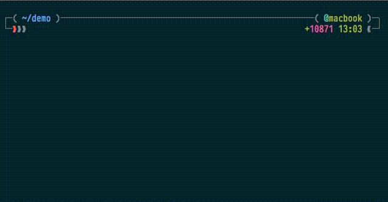

### Execution trace prompt (PS4)

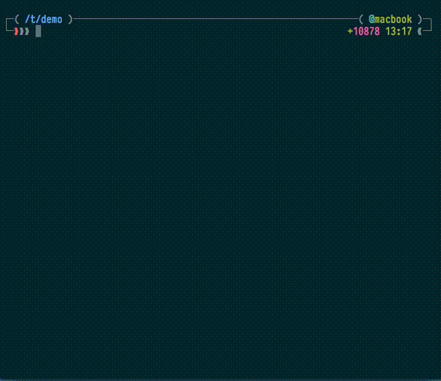

### Autocorrection prompt

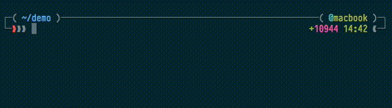

### Backup root prompt

There is a backup root prompt that will highlight most of the terminal in red if
you switch to the sudo user inside another shell which hasn't set this prompt.
It's a simple safety measure.

NOTE: This feature is available only when the shell environment is not reset by
switching to the `sudo` command. *i.e.,* switch to root using `sudo -s` and you
will see the prompt change its primary color to red (as described above); switch
to root with `sudo -i`, the environment will be largely reset and you'll see the
base zsh prompt instead of my custom one.

## Features

This prompt has the following features. These features may be disabled and
rearranged as desired by using the corresponding tokens. There are also minor
changes that can (easily) be made in terms of formatting the output of the
prompt by editing the prompt file itself but that's up to you.

### Change host color when on ssh

You can display either the full or truncated hostname on ssh by editing the
prompt file. The default is to display the truncated hostname.

Note that all of the prompt goes from gray to orange—when making the gif, some
of the color was lost.

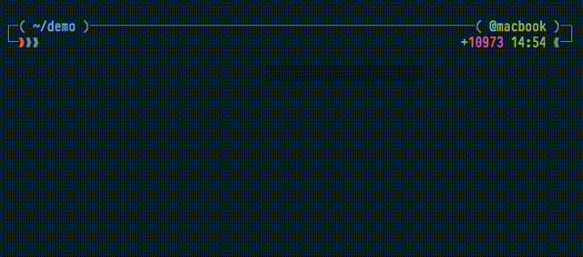

### Change prompt color when UID is root

As a safety feature, the prompt will change color when logged in as the root
user. This looks the same as host color change on ssh but with a red color
instead of orange.

### ls the directory contents on cd

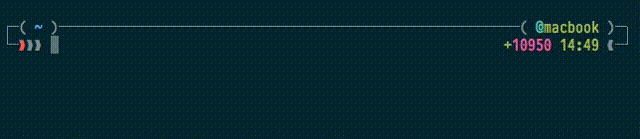

### Determine the number of background jobs

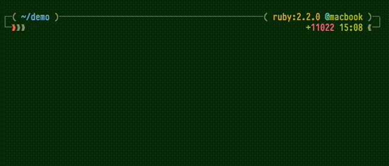

### Present working directory truncation, if needed

Directory truncation will slim down the $PWD to the first letter of each child
directory; it can be turned off by editing the prompt file.

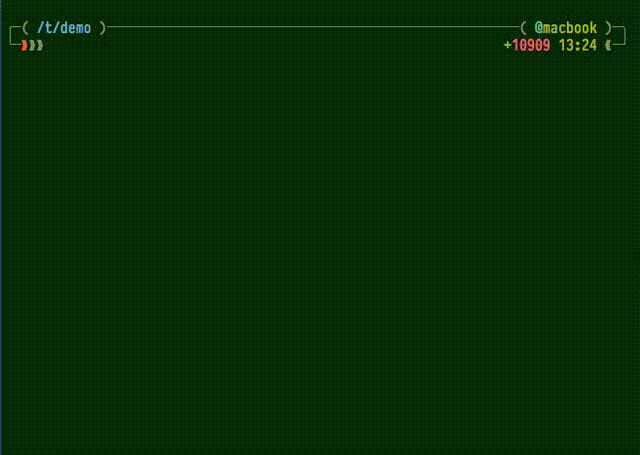

### Report non-zero return codes

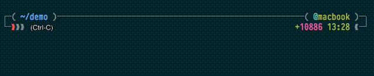

### Report local time

You can change to time format from within the prompt file. Available options:

- 24 hour time format (default)
- 24 hour time format, second precise
- AM/PM time format

### Report the terminal line number

Useful for bang history completion and hipster pride.

### Report git status, git remote status, git prompt info and git SHA information

| Symbol   | Meaning     |
| :---:    | :---        |
| λ:master | branch      |
| 9769ee9  | commit hash |
| \|       | dirty       |
| ⬆        | ahead       |
| ⬇        | behind      |
| ⥮        | diverged    |
| ✭        | stashed     |
| ✚        | added       |
| ✗        | deleted     |
| ✱        | modified    |
| ➜        | renamed     |
| ═        | unmerged    |
| ◼        | untracked   |

### Report the currently used ruby version

If you use the default Prezto, the prompt will also show the system's ruby.
If you don't want to see that information, have a look at my [fork of
Prezto](https://github.com/chauncey-garrett/zsh-prezto/blob/master/modules/ruby/
functions/ruby-info).

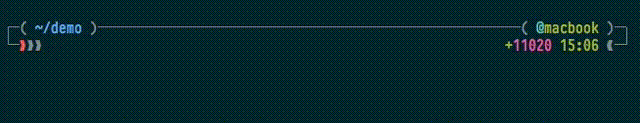

### Indicate vi-mode

Normal mode:

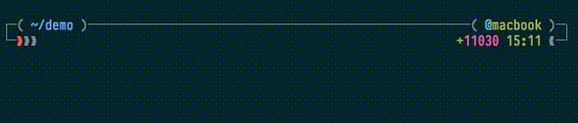

Overwrite mode:

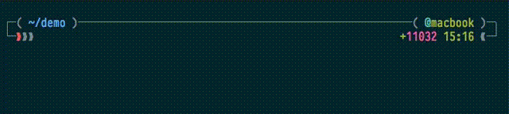

If you like, you can add notification of insert mode by editing the prompt.

### Notifications for commands taking longer than *n* seconds

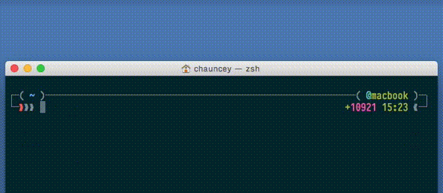

### Shell-level notification

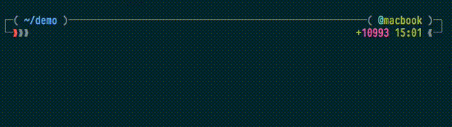

## Like it?

If you've found this project useful, would you consider sending your support?

- [Contribute Feedback](https://github.com/chauncey-garrett/zsh-prompt-garrett/issues) or a [Pull Request](https://github.com/chauncey-garrett/zsh-prompt-garrett/pulls)
- [Provide Support](http://chauncey.io/donate/)
- [Give Bitcoin](https://www.coinbase.com/ChaunceyGarrett)

## Author

*The author of this module should be contacted via the [issue
tracker](https://github.com/chauncey-garrett/zsh-prompt-garrett/issues
"chauncey-garrett/zsh-prompt-garrett/issues").*

|  |
| :------------------------------------------------------------------------------------------------------: |
| [Chauncey Garrett](http://chauncey.io) - [@chauncey_io](http://twitter.com/chauncey_io)                  |

